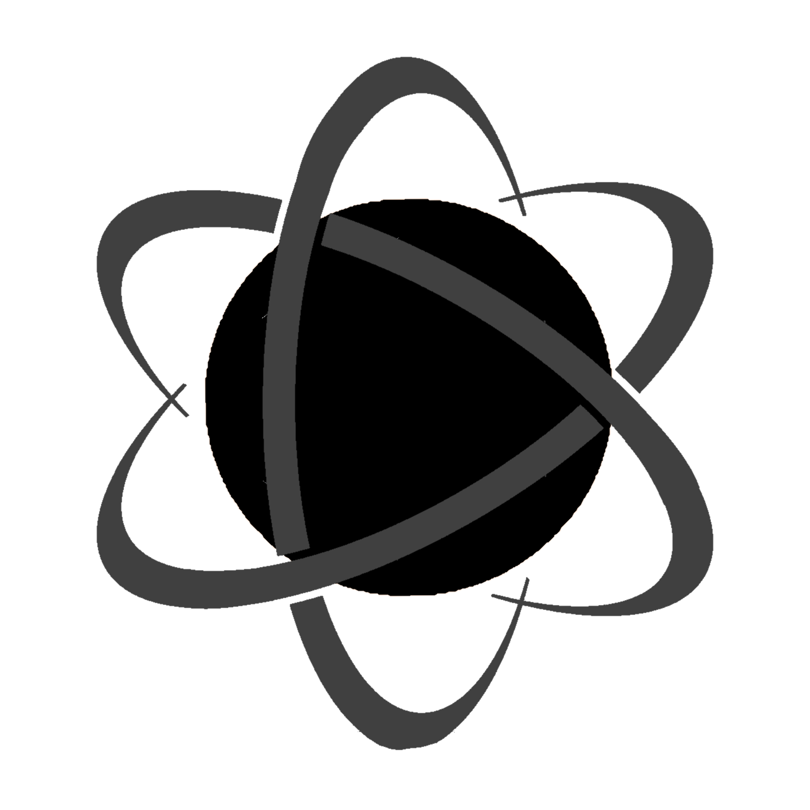
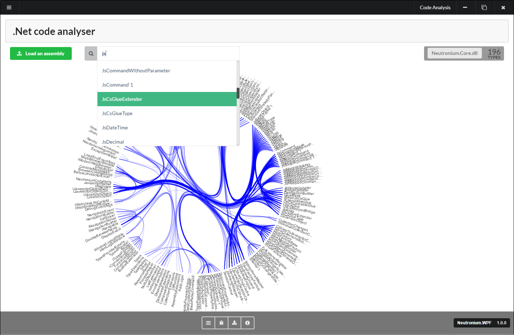
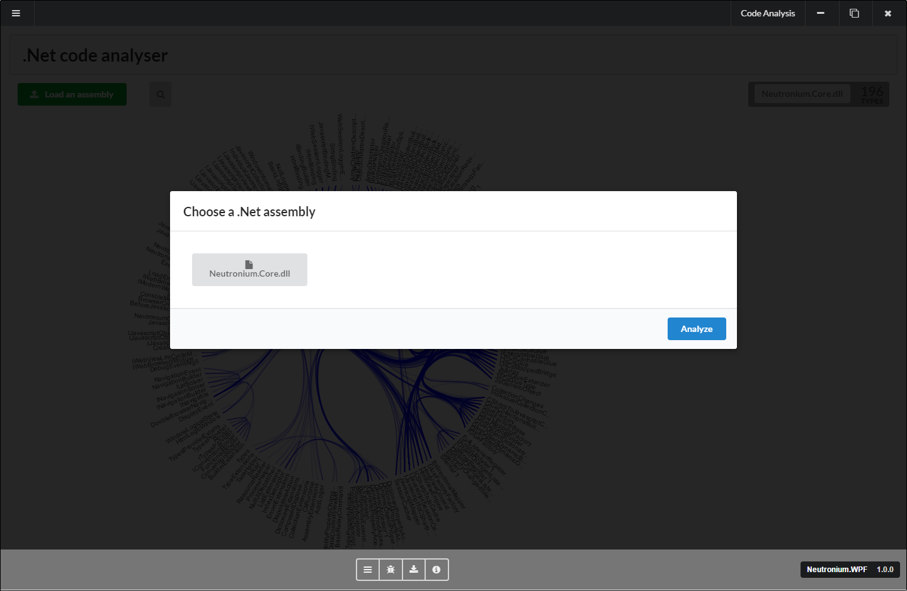
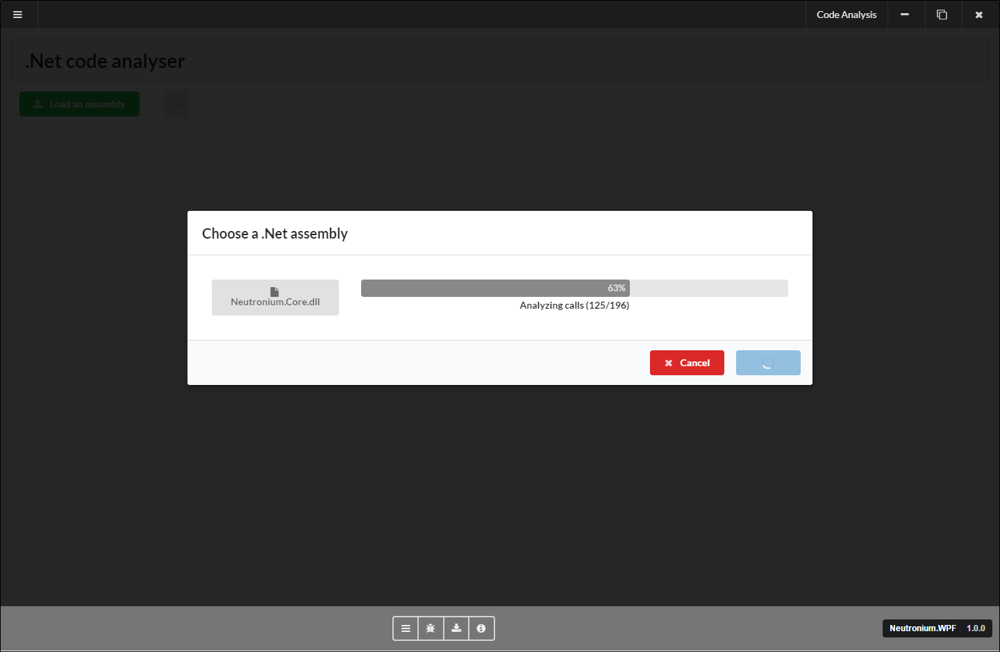

CodeDependencyScanner
====================

C# desktop application that analyses .Net assembly. 
It lets you browse types relationship and introspect code dependencies. 
Originally inspired by [codegravity](https://github.com/fgreinacher/codegravity). 

Made with [Neutronium](https://github.com/NeutroniumCore/Neutronium), [Vue.js](https://vuejs.org) and [D3.js](https://d3js.org).

    
    
    

# Screen shots

